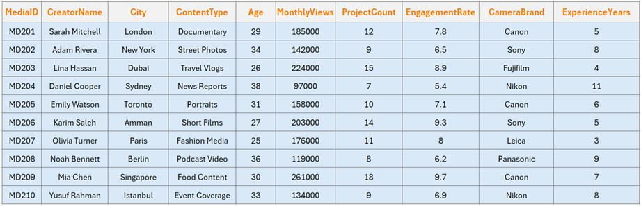

<html lang="en">
<head>
<meta charset="UTF-8">
<meta name="viewport" content="width=device-width, initial-scale=1.0">
<title>Press-Sport-Lens | Media &amp; Photography Analysis</title>

<link rel="preconnect" href="https://fonts.googleapis.com">
<link href="https://fonts.googleapis.com/css2?family=Playfair+Display:wght@700;900&family=Inter:wght@300;400;500;600;700&display=swap" rel="stylesheet">

</head>
<body>

<header>
  

  

    
📸

    

      <h1>Photography-Press عدسة الصحافة الفوتوغرافية</h1>
      
Introduction to coding for journalists AAUP - Done by: Balqees Arar

      📊 10 Creators &middot; Interactive Report &middot; June 2026
    

  

</header>

<nav>
  

    <button class="nav-tab" onclick="showSection('about',this)">🎬 عن المشروع</button>
    <button class="nav-tab active" onclick="showSection('overview',this)">📋 Overview</button>
    <button class="nav-tab" onclick="showSection('experience',this)">📈 Experience</button>
    <button class="nav-tab" onclick="showSection('engagement',this)">💬 Engagement</button>
    <button class="nav-tab" onclick="showSection('cameras',this)">📷 Cameras</button>
    <button class="nav-tab" onclick="showSection('projects',this)">🎬 Projects</button>
    <button class="nav-tab" onclick="showSection('distribution',this)">📊 Distribution</button>
    <button class="nav-tab" onclick="showSection('stats',this)">🔢 Statistics</button>
    <button class="nav-tab" onclick="showSection('insights',this)">💡 Insights</button>
    <button class="nav-tab" onclick="showSection('data',this)">🗃️ Data</button>
  

</nav>

<main>

<!-- OVERVIEW -->
<section id="overview" class="section active">
  

    
KPI

    
<h2>Key Performance Indicators</h2>
Summary metrics across all 10 content creators

  

  

    
👁️
5.3M

Total Monthly Views

    
💬
7.53%

Avg Engagement Rate

    
🏆
8.1 yrs

Avg Experience

    
🎬
948

Total Projects Completed

  

  

    
🏆

    
<h2>Top Performers</h2>
Leading creators by engagement rate and monthly views

  

  

    

    

  

</section>

<!-- EXPERIENCE -->
<section id="experience" class="section">
  

    
01

    
<h2>Experience vs Monthly Views</h2>
Relationship between years of experience and monthly audience reach

  

  

  

</section>

<!-- ENGAGEMENT -->
<section id="engagement" class="section">
  

    
02

    
<h2>Content Type &amp; Engagement</h2>
How different content categories compare by average engagement rate

  

  

  

  

📋

<h2>Engagement by Content Type</h2>

  
<table>
    <thead><tr><th>Content Type</th><th>Avg Engagement Rate (%)</th></tr></thead>
    <tbody><tr><td>Sports Photography</td><td>9.55</td></tr><tr><td>Wedding Photography</td><td>8.35</td></tr><tr><td>Documentary</td><td>8.15</td></tr><tr><td>Street Photography</td><td>6.65</td></tr><tr><td>Press Photography</td><td>4.95</td></tr></tbody>
  </table>

  

🏅

<h2>Top 5 – Engagement Rate</h2>

  
<table>
    <thead><tr><th>#</th><th>Creator</th><th>City</th><th>Content Type</th><th>Engagement Rate (%)</th></tr></thead>
    <tbody><tr><td>1</td><td>Rima Barakat</td><td>Hebron</td><td>Sports Photography</td><td>11.3</td></tr><tr><td>2</td><td>Sara Khalil</td><td>Jerusalem</td><td>Documentary</td><td>9.1</td></tr><tr><td>3</td><td>Nour Saleh</td><td>Bethlehem</td><td>Wedding Photography</td><td>8.6</td></tr><tr><td>4</td><td>Khalid Zubari</td><td>Nablus</td><td>Wedding Photography</td><td>8.1</td></tr><tr><td>5</td><td>Layla Hassan</td><td>Ramallah</td><td>Sports Photography</td><td>7.8</td></tr></tbody>
  </table>

</section>

<!-- CAMERAS -->
<section id="cameras" class="section">
  

    
03

    
<h2>Camera Brand Analysis</h2>
Average monthly views by camera brand used

  

  

    

    

  

  

📋

<h2>Camera Brand – Avg Views</h2>

  
<table>
    <thead><tr><th>Camera Brand</th><th>Avg Monthly Views</th></tr></thead>
    <tbody><tr><td>Canon</td><td>805000</td></tr><tr><td>Sony</td><td>620000</td></tr><tr><td>Fujifilm</td><td>392500</td></tr><tr><td>Nikon</td><td>290000</td></tr></tbody>
  </table>

</section>

<!-- PROJECTS -->
<section id="projects" class="section">
  

    
06

    
<h2>Projects vs Monthly Views</h2>
Does a higher project count translate to more monthly views?

  

  

  

🏅

<h2>Top 5 – Monthly Views</h2>

  
<table>
    <thead><tr><th>#</th><th>Creator</th><th>City</th><th>Content Type</th><th>Monthly Views</th></tr></thead>
    <tbody><tr><td>1</td><td>Rima Barakat</td><td>Hebron</td><td>Sports Photography</td><td>1200000</td></tr><tr><td>2</td><td>Sara Khalil</td><td>Jerusalem</td><td>Documentary</td><td>810000</td></tr><tr><td>3</td><td>Faris Qasim</td><td>Tulkarm</td><td>Documentary</td><td>675000</td></tr><tr><td>4</td><td>Layla Hassan</td><td>Ramallah</td><td>Sports Photography</td><td>540000</td></tr><tr><td>5</td><td>Dina Awad</td><td>Ramallah</td><td>Street Photography</td><td>510000</td></tr></tbody>
  </table>

</section>

<!-- DISTRIBUTION -->
<section id="distribution" class="section">
  

    
📊

    
<h2>Distribution Analysis</h2>
How monthly views are spread across creators

  

  

</section>

<!-- STATS -->
<section id="stats" class="section">
  

    
07

    
<h2>Descriptive Statistics</h2>
Summary statistics for all numerical columns

  

  
<table>
    <thead><tr><th>Statistic</th><th>Age</th><th>MonthlyViews</th><th>ProjectCount</th><th>EngagementRate</th><th>ExperienceYears</th></tr></thead>
    <tbody><tr><td><strong>count</strong></td><td>10.0</td><td>10.0</td><td>10.0</td><td>10.0</td><td>10.0</td></tr><tr><td><strong>mean</strong></td><td>31.3</td><td>531000.0</td><td>94.8</td><td>7.53</td><td>8.1</td></tr><tr><td><strong>std</strong></td><td>5.21</td><td>300146.26</td><td>31.84</td><td>1.93</td><td>3.93</td></tr><tr><td><strong>min</strong></td><td>24.0</td><td>195000.0</td><td>45.0</td><td>4.7</td><td>3.0</td></tr><tr><td><strong>25%</strong></td><td>27.5</td><td>328750.0</td><td>75.0</td><td>6.52</td><td>5.25</td></tr><tr><td><strong>50%</strong></td><td>30.5</td><td>470000.0</td><td>93.5</td><td>7.5</td><td>7.5</td></tr><tr><td><strong>75%</strong></td><td>34.5</td><td>641250.0</td><td>109.75</td><td>8.48</td><td>10.5</td></tr><tr><td><strong>max</strong></td><td>40.0</td><td>1200000.0</td><td>156.0</td><td>11.3</td><td>15.0</td></tr></tbody>
  </table>

  

📌

<h2>Categorical Summary</h2>

  

    
📹
Documentary

Most Common Content Type

    
📷
Canon

Most Common Camera Brand

  

</section>

<!-- INSIGHTS -->
<section id="insights" class="section">
  

    
💡

    
<h2>Analytical Insights</h2>
Key findings derived from the dataset

  

  

    

📈
<h3>Experience Paradox</h3>
Less-experienced creators like Rima Barakat (3 yrs) can outperform veterans in views, suggesting that content type and audience engagement matter more than tenure alone.

    

🏆
<h3>Sports Photography Leads</h3>
Sports Photography achieves the highest average engagement rate at 9.55%, driven by high-energy, shareable content that resonates strongly with online audiences.

    

📷
<h3>Canon Dominates Reach</h3>
Canon users generate the highest average monthly views, likely reflecting brand preference among sports and high-production content creators in the dataset.

    

🔁
<h3>Projects ≠ Views</h3>
A higher project count does not guarantee higher monthly views. Creators with fewer, more focused projects — like Rima Barakat (45 projects, 1.2M views) — often reach larger audiences.

    

💬
<h3>Engagement Beats Volume</h3>
Press Photography creators average the most projects but lower engagement, indicating that quantity of output alone does not maximise audience interaction or loyalty.

    

🌍
<h3>Geographic Diversity</h3>
Creators span 7 cities across the West Bank, with Ramallah hosting the most creators. The region shows a vibrant, distributed media ecosystem.

  

</section>

<!-- DATA -->
<section id="data" class="section">
  

    
🗃️

    
<h2>Full Dataset</h2>
Complete records for all 10 media creators and photographers

  

  
<table>
    <thead><tr><th>ID</th><th>Creator</th><th>City</th><th>Content Type</th><th>Age</th><th>Monthly Views</th><th>Projects</th><th>Eng. Rate</th><th>Camera</th><th>Exp. Yrs</th></tr></thead>
    <tbody><tr><td>MC001</td><td>Layla Hassan</td><td>Ramallah</td><td>Sports Photography</td><td>29</td><td>540,000</td><td>87</td><td>7.8%</td><td>Canon</td><td>6</td></tr><tr><td>MC002</td><td>Omar Nassar</td><td>Nablus</td><td>Press Photography</td><td>35</td><td>320,000</td><td>124</td><td>5.2%</td><td>Nikon</td><td>11</td></tr><tr><td>MC003</td><td>Sara Khalil</td><td>Jerusalem</td><td>Documentary</td><td>27</td><td>810,000</td><td>63</td><td>9.1%</td><td>Sony</td><td>4</td></tr><tr><td>MC004</td><td>Youssef Amin</td><td>Gaza</td><td>Street Photography</td><td>31</td><td>275,000</td><td>98</td><td>6.4%</td><td>Fujifilm</td><td>8</td></tr><tr><td>MC005</td><td>Rima Barakat</td><td>Hebron</td><td>Sports Photography</td><td>24</td><td>1,200,000</td><td>45</td><td>11.3%</td><td>Canon</td><td>3</td></tr><tr><td>MC006</td><td>Tariq Mansour</td><td>Jenin</td><td>Press Photography</td><td>40</td><td>195,000</td><td>156</td><td>4.7%</td><td>Nikon</td><td>15</td></tr><tr><td>MC007</td><td>Nour Saleh</td><td>Bethlehem</td><td>Wedding Photography</td><td>33</td><td>430,000</td><td>112</td><td>8.6%</td><td>Sony</td><td>9</td></tr><tr><td>MC008</td><td>Faris Qasim</td><td>Tulkarm</td><td>Documentary</td><td>26</td><td>675,000</td><td>71</td><td>7.2%</td><td>Canon</td><td>5</td></tr><tr><td>MC009</td><td>Dina Awad</td><td>Ramallah</td><td>Street Photography</td><td>38</td><td>510,000</td><td>89</td><td>6.9%</td><td>Fujifilm</td><td>13</td></tr><tr><td>MC010</td><td>Khalid Zubari</td><td>Nablus</td><td>Wedding Photography</td><td>30</td><td>355,000</td><td>103</td><td>8.1%</td><td>Nikon</td><td>7</td></tr></tbody>
  </table>

</section>

<!-- ABOUT -->
<section id="about" class="section">
  

فكرة المشروع:<

هذا المشروع عبارة عن تحليل بيانات لصناع المحتوى والمصورين باستخدام لغة Python يتضمن المشروع بيانات لعشرة مصورين تحتوي على معلومات مثل الاسم، العمر، المدينة ، نوع المحتوى، عدد المشاهدات الشهرية، عدد المشاريع المنجزة، معدل التفاعل، نوع الكاميرا المستخدمة، وسنوات الخبرة تم جمع هذه البيانات بهدف دراسة العوامل التي تؤثر في نجاح صناع المحتوى والمصورين وفهم العلاقة بين الخبرة والأداء الرقمي من خلال المشروع تم استخدام أدوات تحليل البيانات والرسوم البيانية لإجراء   مقارنات بين صناع المحتوى والمصورين من حيث عدد المشاهدات ومعدل التفاعل وعدد المشاريع المنجزة. كما تم تحليل تأثير الخبرة ونوع المحتوى على مستوى الأداء، مما ساعد في استخراج نتائج واستنتاجات توضح أهم العوامل المرتبطة بالنجاح في مجال الإعلام الرقمي والتصوير.

&nbsp;

</section>

</main>

<footer>
  
Photography-Lens مشروع عدسة الصحافة الفوتوغرافية

  
Introduction to coding for journalists AAUP - Instructor: Amjad Khalil

  
Arab American University · Ramallah Campus · Faculty of Modern Media

</footer>

</body>
</html>
